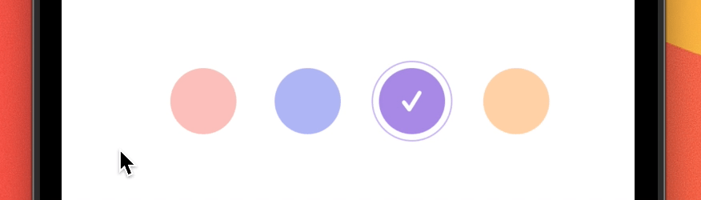

[](https://github.com/WrathChaos/react-native-rounded-checkbox-group)

[](https://www.npmjs.com/package/react-native-rounded-checkbox-group)
[](https://www.npmjs.com/package/react-native-rounded-checkbox-group)

[](https://opensource.org/licenses/MIT)
[](https://github.com/prettier/prettier)

<p align="center">
  
</p>

# Installation

Add the dependency:

```bash
npm i react-native-rounded-checkbox-group
```

## Peer Dependencies

<h5><i>IMPORTANT! You need install them</i></h5>

```js
"react-native-rounded-checkbox": ">= 0.3.3",
```

# Usage

## Import

```jsx
import RoundedCheckboxGroup, {
  ICheckboxButton,
} from "react-native-rounded-checkbox-group";
```

## Fundamental Usage

```jsx
<RoundedCheckboxGroup
  data={staticData}
  initial={0}
  onChange={(selectedItem: ICheckboxButton) => {
    setSelectedItem(selectedItem);
  }}
/>
```

## Advanced Usage

```jsx
<RoundedCheckboxGroup
  data={staticData}
  initial={2}
  onChange={(selectedItem: ICheckboxButton) => {
    setSelectedItem(selectedItem);
  }}
  component={(isActive: boolean) =>
    isActive && <Icon name="check" type="Entypo" color="#fff" />
  }
/>
```

## Data format

You MUST follow this data format as `ICheckboxButton`

```json
[
  {
    id: 0,
  },
  {
    id: 1,
  },
  {
    id: 2,
  },
  {
    id: 3,
  },
];
```

## Advanced and Customization Data Format Example

You can find the working/running example on the `example` project

```jsx
const staticData: ICheckboxButton[] = [
  {
    id: 0,
    text: "",
    checkedColor: "#ff7473",
    uncheckedColor: "#fbbfbb",
    outerStyle: _outerStyle("#fbbfbb"),
    innerStyle: styles.innerStyle,
  },
  {
    id: 1,
    text: "",
    checkedColor: "#5567e9",
    uncheckedColor: "#afb5f5",
    outerStyle: _outerStyle("#afb5f5"),
    innerStyle: styles.innerStyle,
  },
  {
    id: 2,
    text: "",
    checkedColor: "#a98ae7",
    uncheckedColor: "#cab6f4",
    outerStyle: _outerStyle("#cab6f4"),
    innerStyle: styles.innerStyle,
  },
  {
    id: 3,
    text: "",
    checkedColor: "#fcb779",
    uncheckedColor: "#ffd1a7",
    outerStyle: _outerStyle("#ffd1a7"),
    innerStyle: styles.innerStyle,
  },
];
```

## Example Project 😍

You can checkout the example project 🥰

Simply run

- `npm i`
- `react-native run-ios/android`

should work of the example project.

# Configuration - Props

You can use any customization on the `react-native-rounded-checkbox` component.

[Configuration Options](https://github.com/WrathChaos/react-native-rounded-checkbox#readme)

## Future Plans

- [x] ~~LICENSE~~
- [ ] Write an article about the lib on Medium

## Author

FreakyCoder, kurayogun@gmail.com

## License

React Native Rounded Checkbox Group is available under the MIT license. See the LICENSE file for more info.
